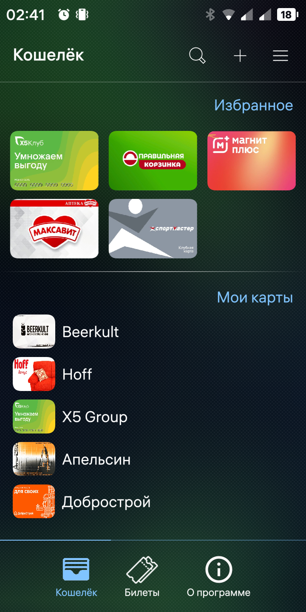
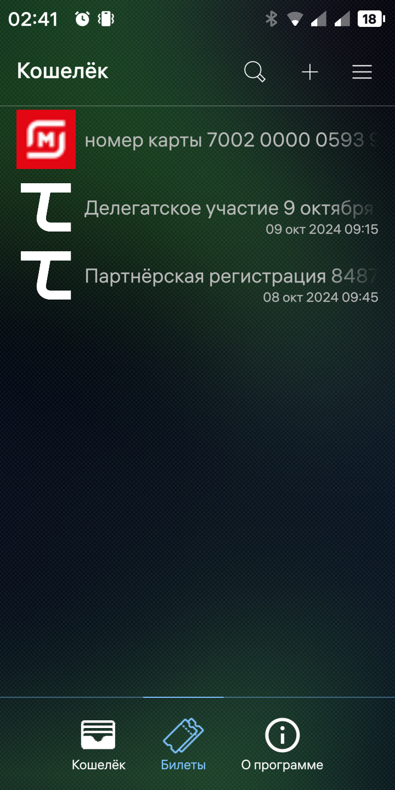

# Wallet
Программа Кошелек для хранения скидочных карт для Аврора ОС
- Есть сканирование с детектом типа кода, на данный момент 
   поддерживаются 5 самых распространенных типа карт Code 128, 
   Code 39, PDF417,  EAN 13 и QR 
- Избранное для 6 карт 
- Редактирование уже добавленных с возможностью задать свое 
   изображение для каждой карты.  
- Фотографирование обложек карт в режиме редактирования.
- Импорт /экспорт для бэкапа, на случай замены или сброса телефона.
- Поиск по добавленным картам.
- Поддержка яблочного формата билетов pkpass с возможностью добавить событие в календарь.

Данная програма использует следующие открытые решения 
 [zint](https://github.com/zint/zint)  в качестве бэкэнда для формирования карт
 [Document Scanner](https://gitlab.com/omprussia/examples/DocumentScanner)  для фотографирования обложек
 [Pass Viewer](https://bitbucket.org/christof_buergi/harbour-passviewer)  для поддержки формата pkpass

## Пожертвования
Если вам понравилось приложение, вы можете пожертвовать автору приложения через
 - [ЮMoney](https://forms.yandex.ru/u/66d272b8068ff021f89c2953/)
 - [Boosty](https://boosty.to/ub3gad/donate)
 - BTC: 1BS637NuDU37T8tfAwVMr5xSDD9vfg1mwT
 - Ton\DOGS\NOT: UQA0lae0x_zHXTeBjL4MfxKT6173nQBzq0R5CMo5owLvsKn3
 

# Wallet
Wallet program for storing discount cards for Aurora OS
- There is scanning with code type detection, at the moment
the 5 most common types of cards are supported Code 128,
Code 39, PDF417, EAN 13 and QR
- Favorites for 6 cards
- Editing already added with the ability to set your own
image for each card.
- Photographing card covers in editing mode.
- Import / export for backup, in case of replacement or reset of the phone.
- Search among added cards
- Support for Apple pkpass ticket format with the ability to add an event to the calendar.
  
This program uses the following open source solutions
[zint](https://github.com/zint/zint)  for generating the (bar)code images
[Document Scanner](https://gitlab.com/omprussia/examples/DocumentScanner)  for photographing card covers 
[Pass Viewer](https://bitbucket.org/christof_buergi/harbour-passviewer)  for support for Apple pkpass

## Donations
If you enjoyed the application, you can donate to the author of the original application via
- [YMoney](https://forms.yandex.ru/u/66d272b8068ff021f89c2953/)
- [Boosty](https://boosty.to/ub3gad/donate)
- BTC 1BS637NuDU37T8tfAwVMr5xSDD9vfg1mwT
- Ton\DOGS\NOT: UQA0lae0x_zHXTeBjL4MfxKT6173nQBzq0R5CMo5owLvsKn3

